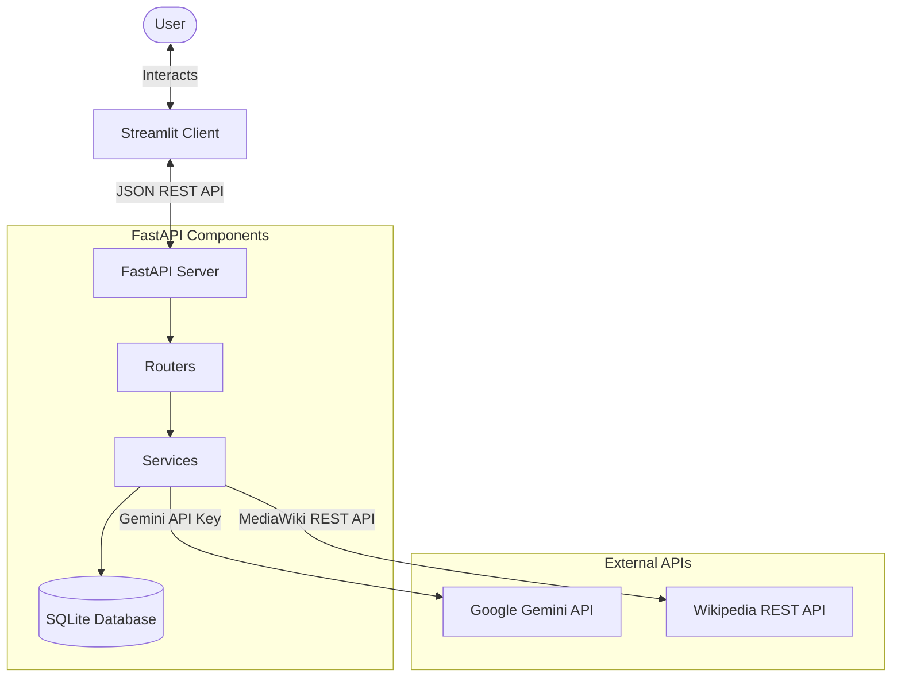
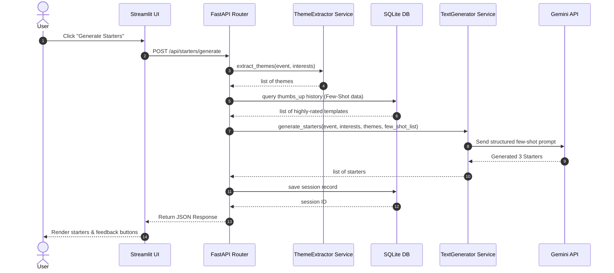
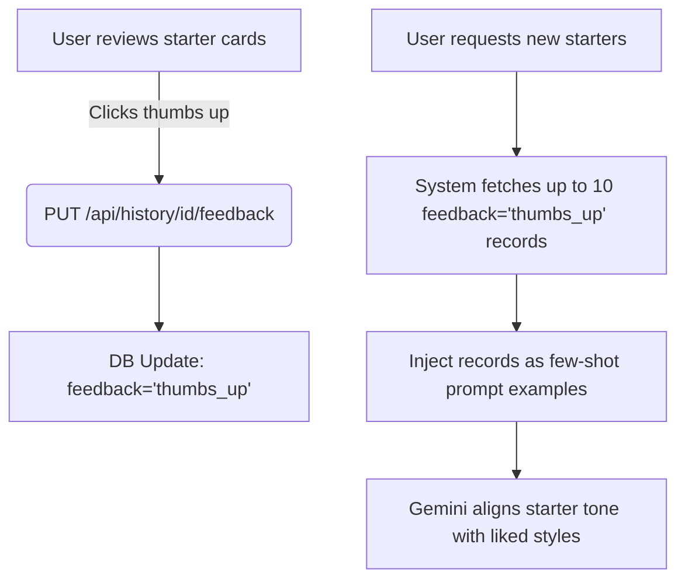
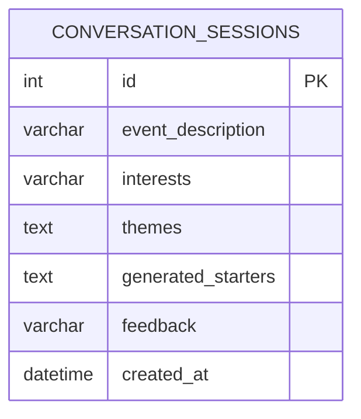

# Project Design Specifications - NetConnect

This document details the architectural layout, entity relations, and system workflows for the NetConnect application.

---

## 1. System Architecture

NetConnect uses a decoupled multi-tier architecture dividing UI presentation, API orchestration, and external AI/data services.

---

## 2. Dynamic Workflow Design

### A. Conversation Starter Generation Sequence
The generation endpoint (`/api/starters/generate`) routes requests through theme extraction, historical few-shot reinforcement checks, and LLM orchestration.

### B. Feedback Reinforcement Workflow
User interactions update historical datasets to dynamically direct future generation requests.

---

## 3. Database ER Diagram

The local SQLite relational database is mapped using SQLAlchemy ORM to track session records and ratings.

### Table Schema: `conversation_sessions`
- `id` (Integer, Primary Key): Auto-incrementing session index.
- `event_description` (String): Raw event details.
- `interests` (String): Raw user interests.
- `themes` (Text): Serialized JSON array of extracted themes.
- `generated_starters` (Text): Serialized JSON array of generated conversation starters.
- `feedback` (String): Feedback status (NULL, `'thumbs_up'`, or `'thumbs_down'`).
- `created_at` (DateTime): Record creation timestamp (defaults to UTC).

