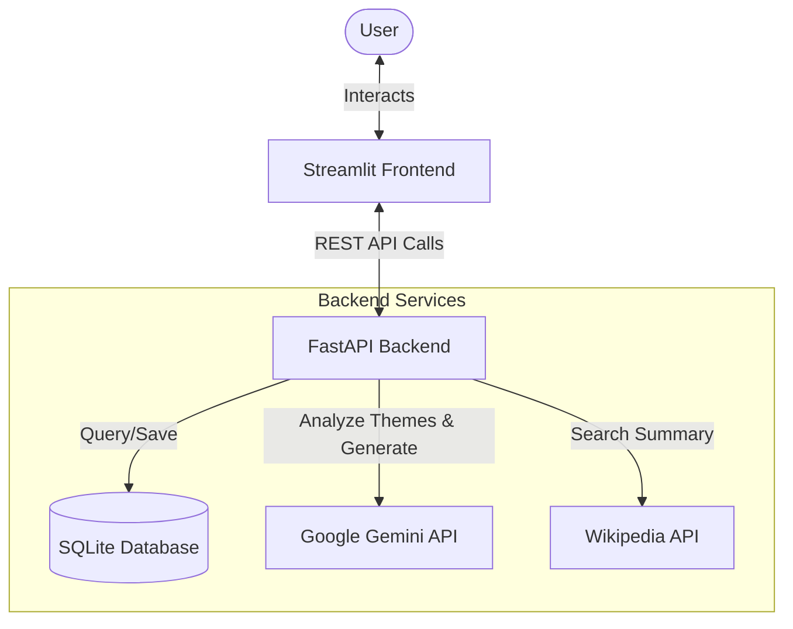
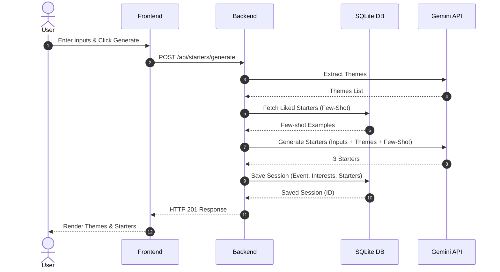

# System Architecture - NetConnect

This document describes the architectural layout, core components, and data flow of the **NetConnect (Personalized Networking Assistant)** web application.

---

## 1. High-Level Architecture Overview

NetConnect is designed as a decoupled, multi-tier AI-powered web application:

- **Frontend (Streamlit)**: Serves as the user interface, facilitating interactive forms, historical logs, rating buttons, and fact search. Located at `05_Project_Development/frontend/`.
- **Backend (FastAPI)**: Serves as the REST API gateway, orchestrating model interactions, database queries, and fact verifications. Located at `05_Project_Development/backend/`.
- **NLP & LLM Orchestrator (Google Gemini API)**: Extracts themes and generates conversation starters using contextual cues and few-shot examples.
- **External API Integrations (Wikipedia REST API)**: Dynamically verifies technical concepts.
- **Database (SQLite & SQLAlchemy)**: Stores session histories and feedback loops for reinforcement learning.

---

## 2. Core Components (located inside `05_Project_Development/`)

### Frontend (Streamlit)
- **`frontend/app.py`**: The single-page application entrypoint. Configures the UI layout, sidebars, API key parameters, and routes views:
  - **Starter Generator**: Accepts Event Description and User Interests.
  - **Fact Checker**: Searches and displays Wikipedia extracts.
  - **History & Feedback**: Displays logs of past generated templates and manages interactive thumbs-up/thumbs-down ratings.
- **`frontend/styles/style.css`**: Injectable custom CSS styling implementing a sleek dark mode, glassmorphic starter cards, glowing gradient headings, custom button micro-animations, and theme badges.

### Backend (FastAPI)
- **`backend/app/main.py`**: Boots the FastAPI server and aggregates routers. Initializes database tables on startup using SQLAlchemy schemas.
- **`backend/routers/`**:
  - `starters.py`: Handles generation workflows.
  - `facts.py`: Serves fact verification endpoint.
  - `history.py`: Serves historical logs fetch and feedback submission.
- **`backend/database/connection.py`**: Configures the SQLAlchemy SQLite database engine, local thread session factory, and database connection context injection dependency (`get_db`).
- **`backend/models/conversation.py`**: Defines the `conversation_sessions` table schema tracking event descriptions, user interests, serialized extracted themes, generated output list, rating status, and UTC creation timestamp.
- **`backend/schemas/starter.py`**: Configures strict request/response data shapes using Pydantic models.
- **`backend/services/`**:
  - `theme_extractor.py`: Identifies themes using Gemini API or a rule-based regex fallback parser.
  - `text_generator.py`: Generates starters using Gemini API (with few-shot prompts using highly-rated history entries) or falls back to professional templates.
  - `fact_verifier.py`: Integrates Wikipedia API actions.
  - `db_service.py`: Standardizes SQL execution.

---

## 3. Key Workflows & Data Flows

### A. Conversation Starter Generation Workflow
1. User enters the Event Description and personal interests, then clicks "Generate Starters".
2. Frontend sends a `POST` request to `/api/starters/generate`.
3. Backend calls `ThemeExtractor` to obtain key topics.
4. Backend calls `DBService` to fetch up to 10 previously liked starters (feedback = `thumbs_up`) for **Few-Shot Learning**.
5. Backend invokes `TextGenerator` to construct the LLM prompt combining:
   - Event Description
   - User Interests
   - Extracted Themes
   - Liked Examples (Few-Shot Prompting)
6. Gemini API generates 3 conversation starters.
7. Backend saves the session in SQLite database (defaults to unrated feedback) and returns the JSON payload to the frontend.

### B. Feedback Loop & Reinforcement
- Users can click 👍 or 👎 on any starter card.
- This fires a `PUT` request to `/api/history/{session_id}/feedback`.
- Database updates the entry's `feedback` field.
- Future generation requests query these `thumbs_up` entries, feeding them back into the Gemini model as dynamic few-shot templates, continuously refining the output to match user-favored tones.
