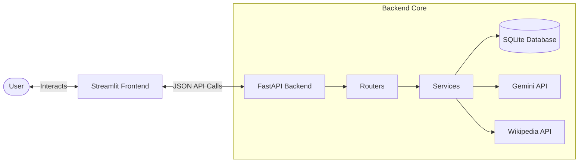
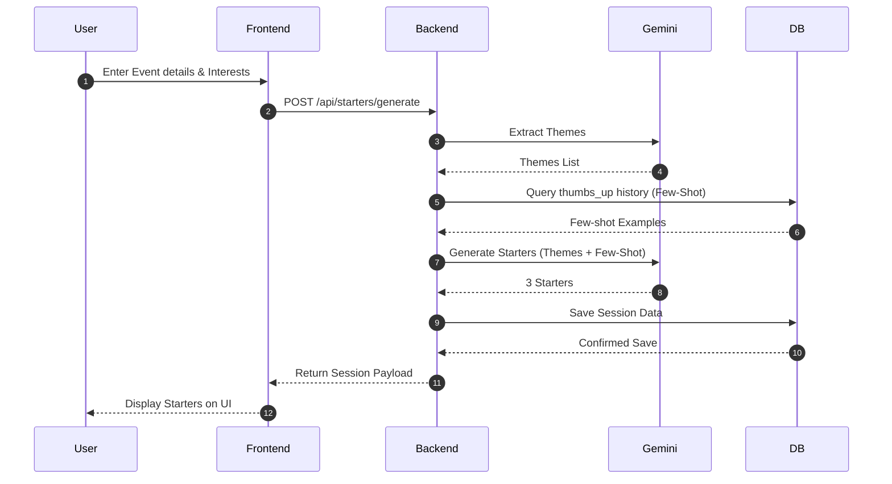
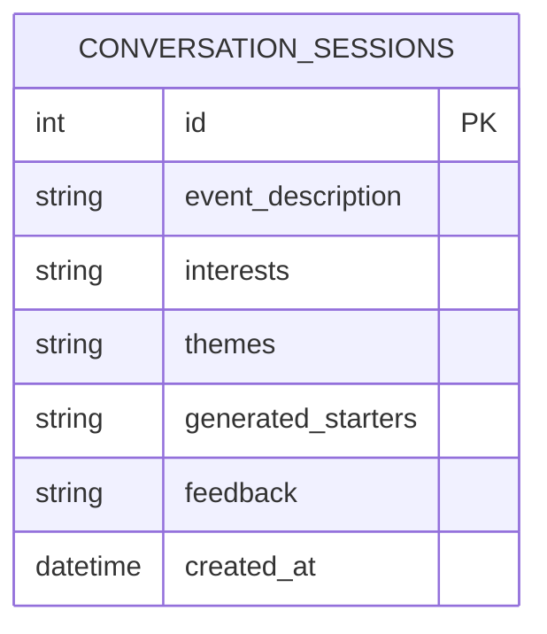

# NetConnect — Personalized Networking Assistant


<div align="center">

[](LICENSE)
[](https://www.python.org/)
[](https://fastapi.tiangolo.com/)
[](https://streamlit.io/)

*AI-Powered Web Application to Generate Personalized Conversation Starters for Professional Networking Events.*

[Explore Docs](07_Project_Documentation/Project_Report.md) · [Submit Issue](https://github.com/SurendraBehra/Personalized-Networking-Assistant/issues)

</div>


---

## 📖 Table of Contents
- [Project Overview](#-project-overview)
- [Problem Statement](#-problem-statement)
- [The Solution](#-the-solution)
- [Key Features](#-key-features)
- [Technology Stack](#-technology-stack)
- [SDLC Repository Folder Structure](#-sdlc-repository-folder-structure)
- [System Architecture](#-system-architecture)
- [Application Workflow](#-application-workflow)
- [Installation & Local Setup](#-installation--local-setup)
- [Configuration](#-configuration)
- [Running the Project](#-running-the-project)
- [REST API Endpoints](#-rest-api-endpoints)
- [Screenshots & User Interface](#-screenshots--user-interface)
- [Sample Input & Output](#-sample-input--output)
- [Database Design](#-database-design)
- [Testing Suite](#-testing-suite)
- [Security Features](#-security-features)
- [Error Handling](#-error-handling)
- [Future Enhancements](#-future-enhancements)
- [Contributors](#-contributors)
- [License](#-license)
- [Acknowledgements](#-acknowledgements)

---

## 🌟 Project Overview

**NetConnect (Personalized Networking Assistant)** is an intelligent web application designed to ease social anxiety and elevate professional communication during networking events. By processing event details and your personal expertise through NLP and LLM layers, it creates personalized, open-ended icebreakers tailored to establish meaningful relationships.

---

## ❓ Problem Statement

Professional networking is critical for career growth, yet many individuals face:
1. **Social Friction**: Difficulty initiating natural, professional conversations with strangers.
2. **Lack of Context**: Attending niche panel discussions or technical summits without knowing how to connect complex event topics to their own skills.
3. **Preparedness Gaps**: Forgetting key definitions, trends, or concepts when engaging in industry conversations.

---

## 💡 The Solution

NetConnect solves these pain points by:
- **Deconstructive Theme Extraction**: Dynamically isolating core event themes using Natural Language Processing.
- **Contextual Few-Shot Generation**: Harnessing the power of LLMs (Google Gemini API) along with your past successful networking interactions to generate bespoke icebreakers.
- **On-the-Fly Concept Verification**: Integrating Wikipedia search REST APIs directly into the dashboard for quick verification of technical terms.
- **Reinforcement Feedback Loop**: Storing histories and feedback to refine future generations.

---

## 🛠️ Key Features

- **💡 Dynamic Icebreaker Generator**: Instantly generates 3 targeted conversation starters matching the event topic to your expertise.
- **🔄 Reinforced Few-Shot Learning**: Highly-rated (thumbs-up) starters are saved and fed back to the Gemini model as customized templates, tuning the generator's tone to your preference.
- **🔍 Quick Fact Checker**: Instantly search Wikipedia for technical concepts before introducing yourself.
- **📜 Detailed Interaction History**: Access and filter a timeline of past event generations and update ratings dynamically.
- **🌐 Offline Fallback Mode**: Works seamlessly without API keys by transitioning to rule-based contextual patterns.

---

## ⚙️ Technology Stack

- **Core Language**: Python (3.8 - 3.11)
- **Backend API Layer**: FastAPI & Uvicorn
- **Frontend Dashboard**: Streamlit
- **Database Engine**: SQLite
- **Object-Relational Mapping (ORM)**: SQLAlchemy
- **Generative AI Provider**: Google Gemini API (model `gemini-1.5-flash`)
- **Third-Party APIs**: Wikipedia REST API
- **Data Validation**: Pydantic
- **Environment Management**: python-dotenv

---

## 📂 SDLC Repository Folder Structure

To ensure a professional and structured engineering portfolio, this repository is organized into phases matching the **Software Development Life Cycle (SDLC)**:

```text
Personalized-Networking-Assistant/
├── .github/
│   ├── ISSUE_TEMPLATE/
│   │   ├── bug_report.md
│   │   └── feature_request.md
│   └── workflows/
│       └── python-app.yml
├── 01_Brainstorming/
│   ├── Idea.md
│   └── Brainstorming.md
├── 02_Requirement_Analysis/
│   └── Requirements.md
├── 03_Project_Design/
│   └── Design.md
├── 04_Project_Planning/
│   └── Planning.md
├── 05_Project_Development/
│   ├── backend/
│   │   ├── app/
│   │   │   ├── config.py
│   │   │   └── main.py
│   │   ├── database/
│   │   │   └── connection.py
│   │   ├── models/
│   │   │   └── conversation.py
│   │   ├── routers/
│   │   │   ├── facts.py
│   │   │   ├── history.py
│   │   │   └── starters.py
│   │   ├── schemas/
│   │   │   └── starter.py
│   │   ├── services/
│   │   │   ├── db_service.py
│   │   │   ├── fact_verifier.py
│   │   │   ├── text_generator.py
│   │   │   └── theme_extractor.py
│   │   └── tests/
│   │       ├── test_db_service.py
│   │       ├── test_routers.py
│   │       └── test_services.py
│   ├── frontend/
│   │   ├── styles/
│   │   │   └── style.css
│   │   └── app.py
│   ├── requirements.txt
│   └── run.py
├── 06_Project_Testing/
│   └── Testing.md
├── 07_Project_Documentation/
│   └── Project_Report.md
├── 08_Project_Demonstration/
│   └── Demonstration.md
├── Screenshots/
│   ├── dashboard.png
│   ├── conversation-generator.png
│   ├── fact-verification.png
│   ├── feedback.png
│   ├── history.png
│   └── home.png
├── .gitignore
├── CHANGELOG.md
├── CODE_OF_CONDUCT.md
├── CONTRIBUTING.md
└── LICENSE
```

---

## 🏗️ System Architecture

NetConnect is built on a clean, modular structure. Below is the architectural diagram showing how data passes between the frontend client, backend controllers, databases, and third-party AI APIs.



For a detailed breakdown of components, see the [Solution Architecture in Project Report](07_Project_Documentation/Project_Report.md#43-solution-architecture).

---

## 🔁 Application Workflow

The sequence of operations during a conversation starter generation cycle:



---

## 🚀 Installation & Local Setup

Get your environment up and running in minutes:

### 1. Clone the repo
```bash
git clone https://github.com/SurendraBehra/Personalized-Networking-Assistant.git
cd Personalized-Networking-Assistant
```

### 2. Set up virtual environment
```bash
python -m venv venv
# Activate on Windows:
venv\Scripts\activate
# Activate on macOS/Linux:
source venv/bin/activate
```

### 3. Install dependencies
```bash
cd 05_Project_Development
pip install -r requirements.txt
```

For more detailed setup steps, please consult the [Setup & Installation Guide in Project Report](07_Project_Documentation/Project_Report.md#12-setup--installation-guide).

---

## ⚙️ Configuration

1. Create a `.env` file from the provided example inside the development directory:
   ```bash
   cd 05_Project_Development
   cp .env.example .env
   ```
2. Open `.env` and set your variables:
   ```env
   HOST=127.0.0.1
   PORT=8000
   DATABASE_URL=sqlite:///./networking_assistant.db
   GEMINI_API_KEY=AIzaSy... # Optional: Enter key from Google AI Studio to unlock AI features
   ```

---

## 🏃 Running the Project

Run both the FastAPI Backend and Streamlit Frontend concurrently using the unified orchestrator script inside `05_Project_Development/`:

```bash
cd 05_Project_Development
python run.py
```

- **Swagger Documentation**: [http://127.0.0.1:8000/docs](http://127.0.0.1:8000/docs)
- **Streamlit Web Application**: [http://127.0.0.1:8501](http://127.0.0.1:8501)

---

## 🌐 REST API Endpoints

| Endpoint | Method | Description | Request Body |
| :--- | :--- | :--- | :--- |
| `/` | `GET` | API health check & version info | None |
| `/api/starters/generate` | `POST` | Theme extraction & starter generation | `StarterRequest` |
| `/api/facts/verify` | `POST` | Search & summarize Wikipedia topic | `FactSearchRequest` |
| `/api/history` | `GET` | Fetch historical session records | None |
| `/api/history/{id}/feedback` | `PUT` | Update feedback rating (thumbs-up/down) | `FeedbackUpdateRequest` |

See [REST API Documentation in Project Report](07_Project_Documentation/Project_Report.md#rest-api-documentation) for full JSON payload and response structures.

---

## 📸 Screenshots & User Interface

Here is a look at the application interfaces:

### Main Starter Generator Dashboard


### Real-time Fact verification tool


### Interactive Logs & Chronological History


---

## 📝 Sample Input & Output

### Input
- **Event Description**: `International Green Grid Forum. Discussions focused on hydrogen fuel cell systems, high-voltage grids, and machine learning models for carbon footprint optimization.`
- **Personal Interests**: `predictive analytics, renewable energy, AI ethics`

### Output
```json
{
  "themes": ["Green Grid", "Hydrogen Fuel Cells", "Machine Learning"],
  "starters": [
    "I'm really interested in the intersection of green grid optimization and predictive analytics. What carbon reduction metrics are you prioritizing when deploying your ML models?",
    "With hydrogen fuel cells taking center stage, how do you see smart high-voltage grid topologies scaling to manage their integration over the next five years?",
    "Hello! Regarding the forum topics, do you feel current smart grid standards are robust enough to handle the real-time telemetry required by predictive AI models?"
  ]
}
```

---

## 🗄️ Database Design

NetConnect uses an SQLite database modeled using SQLAlchemy.

### Table Schema: `conversation_sessions`
| Column Name | Data Type | Key Type | Nullable | Description |
| :--- | :--- | :--- | :--- | :--- |
| `id` | `INTEGER` | Primary Key | No | Auto-incrementing identifier. |
| `event_description` | `VARCHAR(500)` | - | No | The event details provided by the user. |
| `interests` | `VARCHAR(500)` | - | No | User's interests/keywords. |
| `themes` | `TEXT` | - | No | JSON-serialized array of extracted topics. |
| `generated_starters` | `TEXT` | - | No | JSON-serialized array of generated conversation starters. |
| `feedback` | `VARCHAR(50)` | - | Yes | Feedback rating (e.g. `'thumbs_up'`, `'thumbs_down'`). |
| `created_at` | `DATETIME` | - | No | UTC timestamp of session creation. |



---

## 🧪 Testing Suite

Automated unit tests cover routers, database workflows, fallbacks, and Wikipedia query mocks.

Run the test suite locally inside `05_Project_Development/`:
```bash
cd 05_Project_Development
python -m unittest discover -s backend/tests
```

---

## 🔒 Security Features

- **Decoupled Configuration**: Sensitive API keys and connection URLs are handled using `python-dotenv` and ignored in `.gitignore`.
- **Session-Specific Keys**: Users can supply their own Gemini API keys directly in the Streamlit Sidebar; these keys are handled in-memory and are never stored in the database.
- **Input Sanitization**: Request bodies are validated using Pydantic models to restrict length and filter out empty fields.

---

## 🚫 Error Handling

NetConnect API handles errors gracefully:
- **422 Unprocessable Entity**: Returns descriptive messages if input characters violate boundary rules.
- **400 Bad Request**: Returns details for invalid feedback options or empty payloads.
- **500 Internal Server Error**: Logs exceptions to stdout and returns safe error responses instead of exposing sensitive traceback contexts.

---

## 🔮 Future Enhancements

- [ ] **Multi-Model Support**: Integrate with OpenAI (GPT-4o) and Anthropic (Claude 3.5 Sonnet) models.
- [ ] **Starred Templates**: Pin favorites to an offline dashboard for quick copy-pasting.
- [ ] **LinkedIn Integration**: Scrape target attendee profiles to build hyper-personalized icebreakers.
- [ ] **Voice-to-Text Inputs**: Speak event descriptions and let AI format them into inputs.

---

## 👥 Contributors

- **Surendra Behra** (Lead Developer) - [surendrabehra2005@gmail.com](mailto:surendrabehra2005@gmail.com)

---

## 📄 License

Distributed under the MIT License. See [LICENSE](LICENSE) for more details.

---

## 💖 Acknowledgements

- Google AI Studio (Gemini API)
- Wikipedia MediaWiki developers
- Streamlit and FastAPI open-source communities
